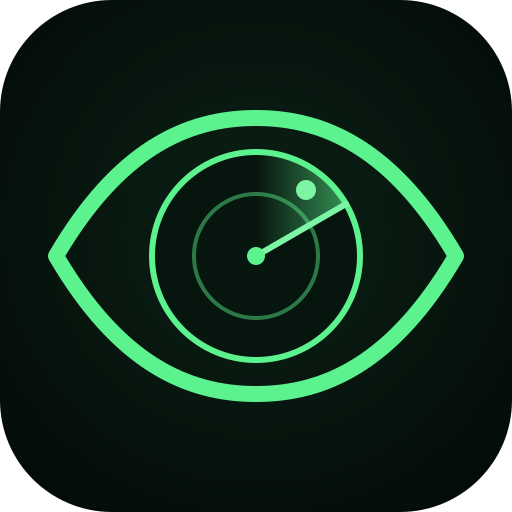

<p align="center">
  
</p>

<h1 align="center">SonderEye</h1>

<p align="center">The planet's live traffic on a 3D globe, on your phone and on Windows.<br>
Free, open source, no account, no backend.</p>

<p align="center">
  <a href="https://github.com/Verisonder/SonderEye/releases/latest"><b>Download</b></a>:
  the APK for Android 8.0 or newer, or the setup / portable app for Windows 10 and 11
</p>

---

SonderEye puts public signals on one native globe: earthquakes, aircraft, satellites,
ships, fires, storms and the weather, drawn on satellite imagery you can zoom from the
whole Earth down to your street. It is a native app for Android and Windows, built from
scratch, not a web page in a wrapper.

## What it shows

**On the globe**
- Earthquakes (USGS), sized by magnitude and coloured by depth.
- Aircraft (adsb.lol), gliding between updates, with 30-minute trails and a follow mode.
- Satellites (CelesTrak), positions computed on the phone every second, with the orbit of
  the one you pick and its next passes over you. GPS and geostationary orbits included.
- Ships (AISStream), fire hotspots (NASA FIRMS) and public webcams (Windy), each with your own free key.
- Natural events (NASA EONET): wildfires, volcanoes, storms, ice.
- Conflicts: places the world's news reports fighting in (GDELT), up to a day back, with
  the stories, and an optional short account of what happened, written by Gemini.
- Rain radar (RainViewer), optionally looping the past hour.
- Surveillance cameras and licence-plate readers mapped in OpenStreetMap.
- Bus lines and stops mapped in OpenStreetMap, each line in its own colour; pick one to see
  its whole route, or ride it: the map follows you and says the next stop and how many are left.
- Live buses wherever the operator publishes GTFS Realtime (found through Transitland, with
  your own free key).
- Day and night, with city lights on the dark side.

**Around it**
- **Today**: the weather where you are and the day's news from the sources you choose,
  with an optional summary written by Gemini, made once a day.
- **Sky view**: point the phone at the sky to see the satellites, aircraft, Sun and Moon above you, labelled.
- **ISS pass alerts**: a notification before each pass you can actually see.
- **Search** for places, flights by callsign, and satellites by name.
- A list of every item in each layer, nearest first, one tap from flying to it; any layer
  can be hidden from the map from its list.

## The globe

- Native OpenGL ES 3.0, camera-relative rendering: no float jitter from 40,000 km down to 120 m.
- Esri satellite imagery, streets, or yesterday's whole Earth from NASA, with roads and place
  names on top; close in, the roads are drawn by the app from OpenStreetMap data, sharp at any zoom.
- The whole Earth at country scale ships inside the app (NASA Blue Marble), so the globe appears at once, even offline.
- Tiles load centre first, parents before children, and are kept on the phone (up to 500 MB).
- Markers lie on the curved surface; satellites face you from orbit.
- A radar scope over the screen centre: bearings, range rings at real ground distances, and a sweep.

## Data sources

| Layer | Source | Key |
|---|---|---|
| Earthquakes | [USGS summary feeds](https://earthquake.usgs.gov/earthquakes/feed/v1.0/geojson.php) | None |
| Flights | [adsb.lol](https://adsb.lol), community-fed ADS-B | None |
| Satellites | [CelesTrak](https://celestrak.org) orbital elements, cached 2 h as they ask | None |
| Natural events | [NASA EONET](https://eonet.gsfc.nasa.gov) | None |
| Built-in globe | NASA Blue Marble Next Generation via GIBS, public domain, bundled by CI | None |
| Streets, roads, labels | Esri World Street Map and reference layers | None |
| Today from space | NASA GIBS, VIIRS NOAA-20 true colour | None |
| Rain radar | [RainViewer](https://www.rainviewer.com/api.html), personal use, zoom 7 at most | None |
| Weather | [Open-Meteo](https://open-meteo.com) | None |
| Night lights | NASA GIBS, VIIRS City Lights 2012 | None |
| Place search | [Nominatim](https://nominatim.org), OpenStreetMap | None |
| Ships | [AISStream](https://aisstream.io) live AIS over WebSocket | Free, GitHub sign-in |
| Webcams | [Windy Webcams API](https://api.windy.com/webcams) | Free |
| Fire hotspots | [NASA FIRMS](https://firms.modaps.eosdis.nasa.gov), VIIRS NOAA-20, last 24 h | Free, e-mail |
| News | Publisher RSS/Atom feeds (12 built in, or your own) | None |
| Written brief | [Google Gemini API](https://aistudio.google.com/apikey), optional | Free tier |
| Surveillance cameras | OpenStreetMap via the [Overpass API](https://overpass-api.de) | None |
| Conflicts | [GDELT](https://www.gdeltproject.org) 15-minute event files: assaults, clashes, mass violence, up to 24 h | None |
| Street-level roads | [OpenFreeMap](https://openfreemap.org) vector tiles (OpenMapTiles, from OpenStreetMap) | None |
| Bus lines and stops | OpenStreetMap via the Overpass API | None |
| Live buses | Operators' GTFS Realtime feeds, found and relayed by [Transitland](https://www.transit.land) | Free |
| Imagery | Esri World Imagery (Esri, Maxar, Earthstar Geographics) | None |

Permissions: internet; location only for "Where I am"; camera only for the sky view; notifications only for pass alerts.

## Installing

1. Download `SonderEye-<version>.apk` from [Releases](https://github.com/Verisonder/SonderEye/releases/latest).
2. Open it on the phone. Android asks once to allow installs from your browser or file manager.
3. Everything without a key works straight away. For ships, webcams, fire hotspots, live
   buses and the written summaries, get the free keys from the menu's **API keys** section
   (each has a Get-a-key button) and paste them in.

The APK is signed with the project's own key, so later releases install over it and keep
your settings.

## Windows

The same app as a native Windows program (`desktop/`), built with Compose for Desktop. It
runs the Android app's own data and maths code (`core/`, and the downloads in `data/`),
compiled straight from `app/src/main/java`, so both behave the same.

- **Download**: `SonderEye-<version>-Setup.exe` installs it (Start menu and desktop shortcut,
  no administrator rights needed); `SonderEye-<version>-Portable.zip` is a folder with
  `SonderEye.exe` that runs from anywhere. Both include their own Java runtime.
- **Touchpad**: slide two fingers to move the map, pinch to zoom.
- **Keyboard**: W A S D (or the arrows) move the map, E picks the point nearest the middle
  (E again for the next), Enter opens it. Hold Ctrl to zoom in, Space to zoom out.
- **Mouse**: drag to move, wheel to zoom at the pointer, right-drag to turn, click to pick,
  double-click to zoom in, right-click (or hold still a second) for the weather there and
  to set it as your place. Escape closes the panel or card on top. It opens full screen; F11
  switches to a normal window and back (Alt+F4 closes it).
- **Your place**: a PC has no GPS, so it comes from your internet connection (to a few km)
  unless you set it yourself; your own place always wins.
- **ISS pass alerts** are Windows notifications, while the app is open.
- Left out on Windows: the sky view (it needs a phone's camera and motion sensors) and
  riding a bus (it needs a position that moves with you).
- The installer is not code-signed: Windows SmartScreen asks once ("More info", then
  "Run anyway").

## Privacy

No account, no server of ours, no analytics. The app asks each source directly for what it
shows; your keys and settings stay on the phone. Your position is used only on the phone,
for "Where I am", the weather, pass alerts and bus rides, and is sent to no one except as the
point of a weather or search request.

## Building

JDK 17 and Gradle 8.9.

```
gradle assembleDebug
gradle testDebugUnitTest
```

Windows: `gradle -p desktop :app:run` to start it, `:app:packageExe` for the installer
(JDK 17; WiX for the installer, as on GitHub's Windows machines).

CI downloads the bundled Blue Marble tiles (`tools/fetch_bluemarble.py`, about 5,500 tiles,
cached between runs) before building; a local build without them still works, just without
the built-in globe. Pushes to `test/**` build a signed test APK and publish it as a pre-release
named `test-<branch>`. Failed builds attach their output to the pre-release `ci-failure`.

More detail in [docs/ARCHITECTURE.md](docs/ARCHITECTURE.md).

## Licence

GPL-3.0-only. See [LICENSE](LICENSE).

Bundled typeface: Roboto Condensed, SIL Open Font License 1.1 ([licenses/RobotoCondensed-OFL.txt](licenses/RobotoCondensed-OFL.txt)).
The S in the logo is drawn from Audiowide, SIL Open Font License 1.1 ([licenses/Audiowide-OFL.txt](licenses/Audiowide-OFL.txt)).
